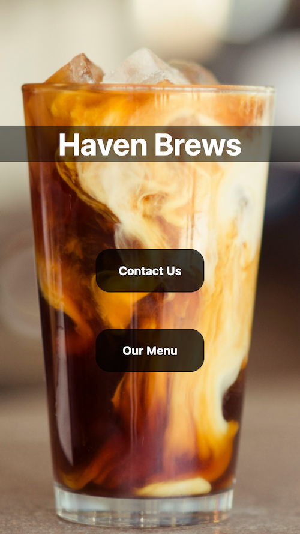
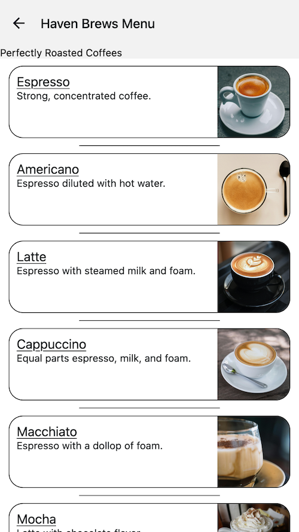

# Haven Brews

<a href="https://tecnate.dev" target="_blank" rel="author">Tecnate</a> | Last Updated: 06 Dec 2024

<!-- TABLE OF CONTENTS -->

  
Table of Contents

  <ol>
    <li>
      <a href="#about-the-project">About The Project</a>
      <ul>
        <li><a href="#built-with">Built With</a></li>
      </ul>
    </li>
    <li>
      <a href="#getting-started">Getting Started</a>
      <ul>
        <li><a href="#prerequisites">Prerequisites</a></li>
        <li><a href="#installation">Installation</a></li>
      </ul>
    </li>
    <li><a href="#usage">Usage</a></li>
    <li><a href="#roadmap">Roadmap</a></li>
    <li><a href="#contributing">Contributing</a></li>
    <li><a href="#license">License</a></li>
    <li><a href="#contact">Contact</a></li>
    <li><a href="#acknowledgments">Acknowledgments</a></li>
  </ol>

<!-- ABOUT THE PROJECT -->

## About The Project

This is a Coffee Shop mobile app, designed to provide a simple and intuitive user experience for customers. This tutorial project was provided by Dave Gray to learn about React Native app development.

The app includes three primary screens:

1. Home Screen: A central hub for navigation, allowing users to easily access the menu and contact information.
2. Menu Screen: Displays a curated list of coffee beverages, complete with names, descriptions, and photos.
3. Contact Screen: Provides essential store details, including the address, phone number, and operating hours, along with quick links to call or text the store directly.

### Built With

This is a project built with React Native and the Expo framework that implements:

-   Expo
    -   Router, Splash Screen.
-   React Native
    -   Stylesheets, Safe Area View, Scroll View, Appearance, Pressable, Image Background, Flat Lists.
-   Light/Dark themes.
-   Custom icons and icon mapping.

<!-- GETTING STARTED -->

## Getting Started

This app is designed for mobile devices or viewport sizes. See the Usage section below.

### Prerequisites

Prior knowledge of:

-   JavaScript, TypeScript, & React
-   Node.js
-   Terminal

### Installation

-   Expo Go installed on a physical device
-   Node.js
-   VS Code or any other preferred code editor or IDE installed
-   A macOS, Linux, or Windows (PowerShell and WSL2) with a terminal window open

<!-- USAGE EXAMPLES -->

## Usage

In the terminal, run `npx expo start` to start Expo (or `npx expo start -c` to start and clear the cache).

-   Type `w` when prompted to see your project render in a web browser.
-   Use your mobile device's camera to scan the QR code that generates in the terminal to see your project render on your mobile screen.

### Troubleshooting

If you encounter errors trying to start Expo on your mobile device or web browser:

1. Delete your **node_modules** directory: `rm -rf node_modules`
2. Reinstall your **node_modules** directory: `npm install`

<!-- ROADMAP -->

## Roadmap

TBD

<!-- CONTRIBUTING -->

## Contributing

This project is for learning/demonstration and is not being actively developed.

<!-- LICENSE -->

## License

Distributed under the [MIT License](https://choosealicense.com/licenses/mit/).

<!-- CONTACT -->

## Contact

Nate: [Website](https://tecnate.dev/) | [GitHub](https://github.com/nvsmith) | [Gravatar Profile](https://gravatar.com/nvsmith435)

<!-- ACKNOWLEDGMENTS -->

## Acknowledgments

#### Dave Gray

-   [React Native for Beginners](https://youtube.com/playlist?list=PL0Zuz27SZ-6OH3xackTS2KLcnmxx5wW7c&si=Hyvi2omsg2536uvf)

#### README Template

-   [Best README Template](https://github.com/othneildrew/Best-README-Template/tree/master)

(<a href="#readme-top">back to top</a>)

